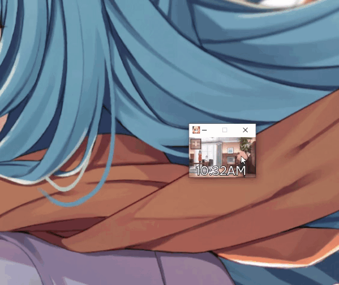

# Anya

A cross-platform customizable clock to add more appeal to the standard and run in pretty mode or minimal mode.



## Available Features:
1. **Turn date off/on** 
2. **Themes**:
   - Change Time & Date typography
   - Minimal mode (just time)
   - Change background to image (GIF supported) or colour
   - Create a custom theme:
     - Change menu background
     - Change button background colour
     - Change button outline colour
     - Change button text colour
 
## How to build:
1. **Clone repository**
   ```
   git clone https://github.com/inohime/Anya.git
   ```
2. **[vcpkg](https://github.com/Microsoft/vcpkg)**
   ```
   git clone https://github.com/Microsoft/vcpkg.git
   cd vcpkg
   ./bootstrap-vcpkg.sh
   ./vcpkg integrate install
   ```
3. **CMake**
   ```
   Generate the build files with Visual Studio Code & CMake Tools
   ```
4. **Unpack `assets.rar` into `build/Debug`**

## Application State
`currently in development`


